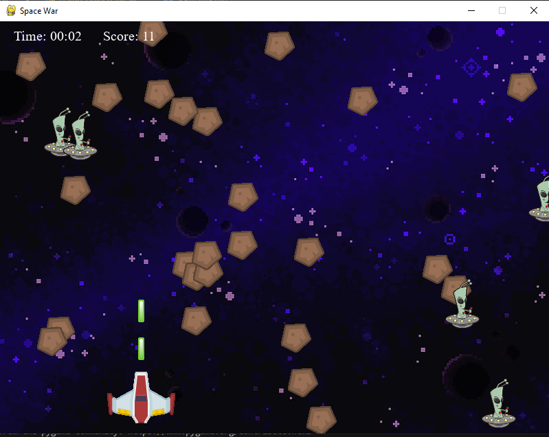

# SPACE WAR

## Descripción
_"SPACE WAR"_ es un juego donde controlas una nave espacial que debe destrir todos los meteoritos y las naves alienigenas antes que sea destruida por ellos. Con gráficos retro y una jugabilidad desafiante, ¡pon a prueba tus habilidades!


### Objetivo:
El objetivo del juego es eliminar todos los meteoros y aliens en el menor tiempo posible y sin que te elimine un alien.

## Capturas de Pantalla




## Requisitos del Sistema
Especifica las dependencias y requisitos del sistema necesarios para ejecutar el juego.

- **Sistema Operativo**: Windows, macOS, Linux
- **Python**: 3.9.5
- **Bibliotecas adicionales**:
  - `pygame 2.4.0 (SDL 2.26.4)`

## Instalación

Proporciona instrucciones claras sobre cómo instalar el juego. Asegúrate de incluir pasos detallados para los usuarios menos técnicos.

1. Clonar este repositorio:
    ```bash
    git clone https://github.com/usuario/repo-del-juego.git
    ```
2. Navegar al directorio del proyecto:
    ```bash
    cd repo-del-juego
    ```
3. Crear y activar un entorno virtual (opcional pero recomendado):
    ```bash
    python -m venv env
    source env/bin/activate  # En Windows: env\Scripts\activate
    ```
4. Instalar las dependencias:
    ```bash
    pip install -r requirements.txt
    ```

## Cómo Jugar
Debes conducir la nave espacial por el espacio y disparar a los meteoros y aliens para eliminarlos y acumular la mayor cantidad de puntos, debes evitar chocar con los aliens porque ellos destruyen la nave.

puntos por eliminar un meteoro = + 1 punto
puntos por eliminar un alien = + 3 puntos
Si un alien colisiona con la nave = game over


### Controles:
- **Flechas**: Moverse de forma horizontal (izquierda y derecha)
- **Barra espaciadora**: Disparar
- **Tecla R**: Reiniciar el juego (game over)
- **Tecla M**: Volver al menú (game over)


